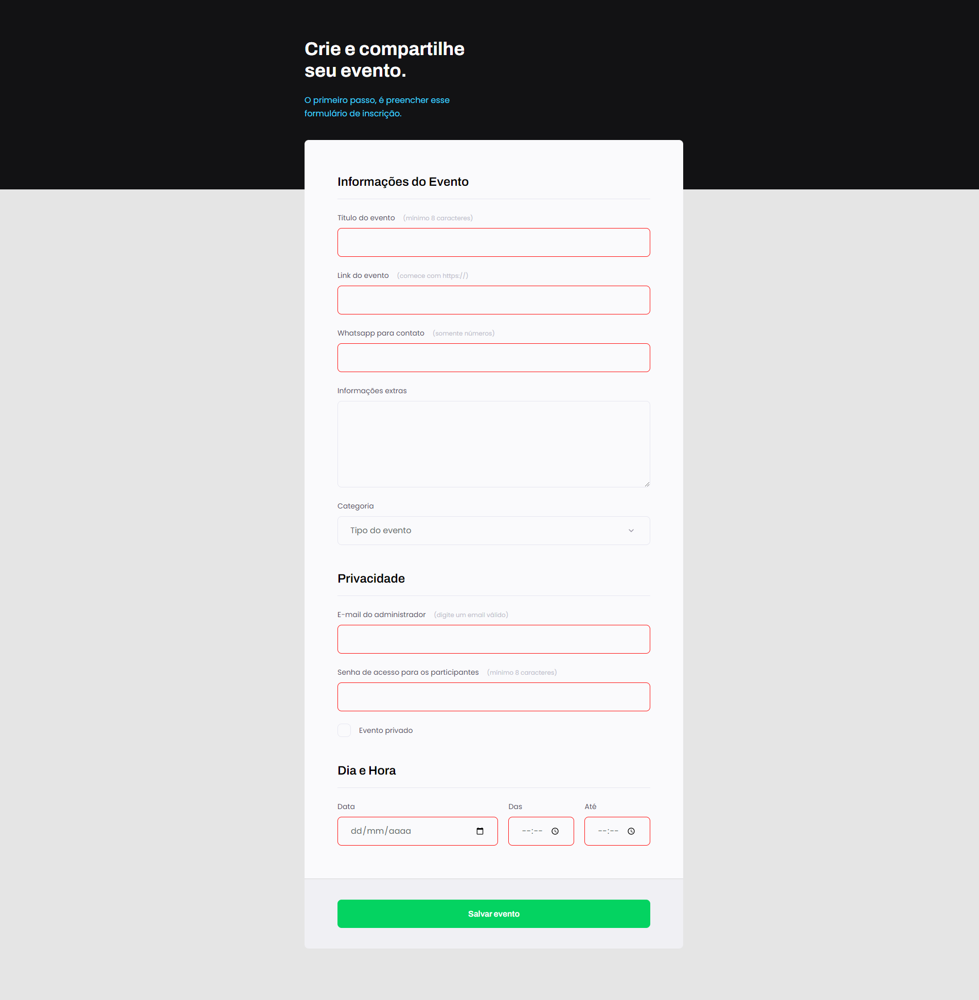

# Criando Formulário

> Trilha Explorer 06

Projeto prático criado na aula da Trilha Explorer 6 da Rocketseat.

[🔗 Clique aqui para acessar](https://hugolinobg.github.io/Desafio-Semantica-e-acessibilidade/)

## 🛠️ Tecnologias

- HTML
- CSS
- GitHub

✉️ Contato

hugolino2609@gmail.com

